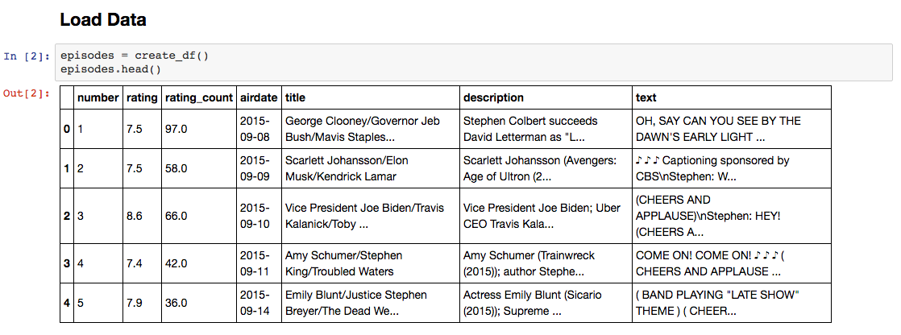
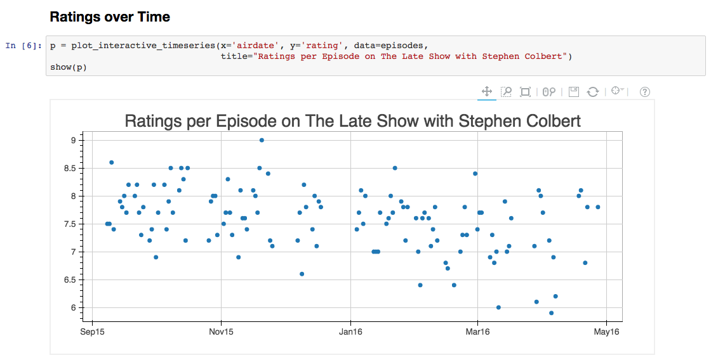

# The Late Show with Stephen Colbert Analysis

Jupyter Notebook: http://nbviewer.jupyter.org/gist/AlJohri/3825066ecfa4688c87f61c1a250aa778

## Usage

1. Update latest `LATEST_EPISODE_NUMBER` in settings.py.
2. `source env.sh`
3. `make data` - download latest data
4. `make notebook` - open jupyter notebook
5. `make gist` - upload latest jupyter notebook to gist and open nbviewer
