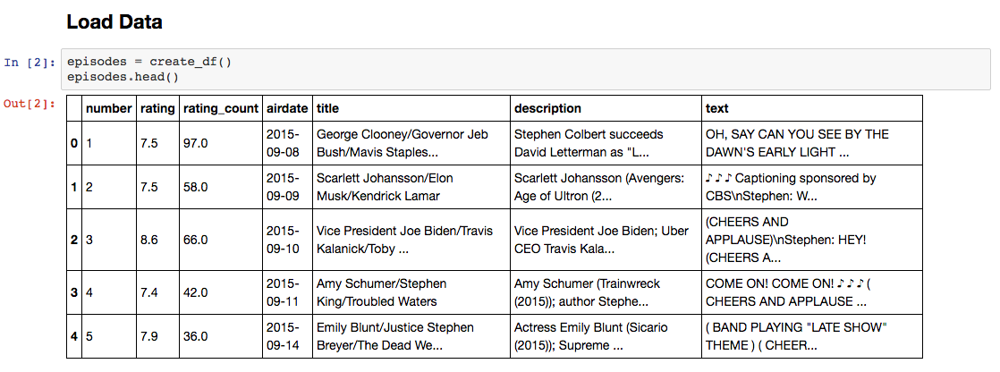
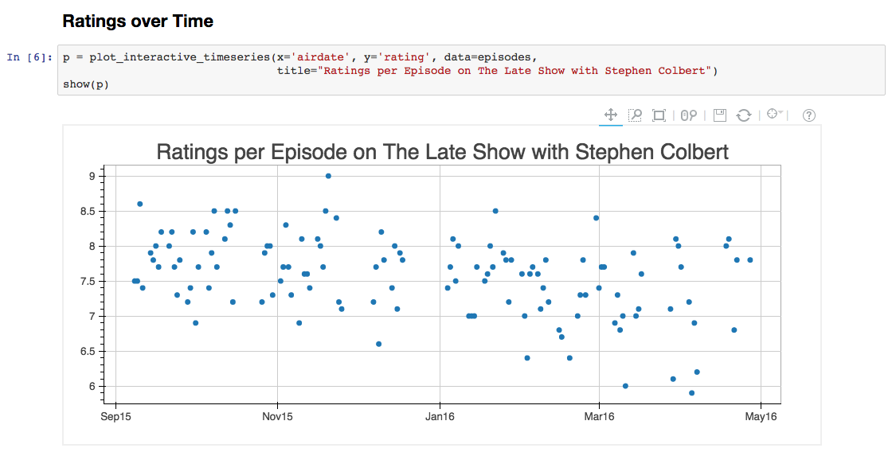
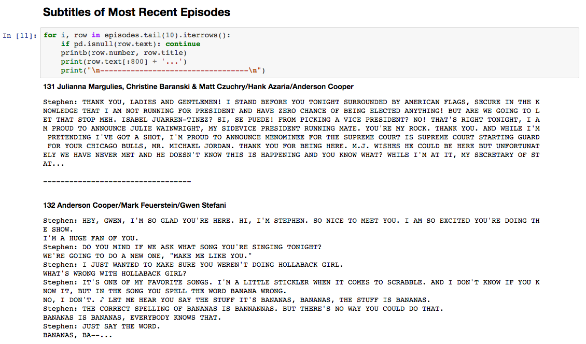

# The Late Show with Stephen Colbert

Jupyter Notebook: http://nbviewer.jupyter.org/gist/AlJohri/3825066ecfa4688c87f61c1a250aa778

## Usage

Update latest `LATEST_EPISODE_NUMBER` in `scripts/settings.py`.

1. `make data` - download latest data
2. `make notebook` - open jupyter notebook
3. `make gist` - upload latest jupyter notebook to gist and open nbviewer
